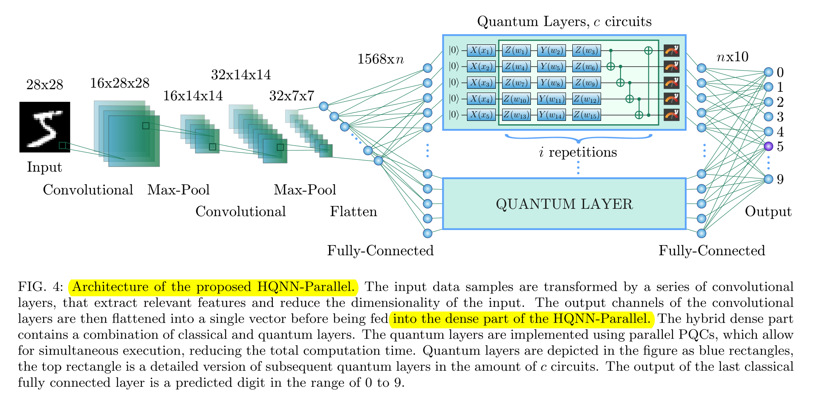
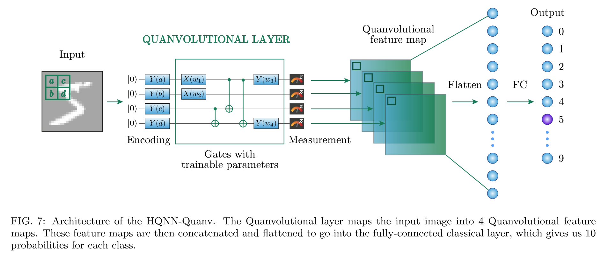

# qml for image classification
# Quantum Machine Learning for Image Classification

This repository reproduces the experiments from the paper **"Quantum Machine Learning for Image Classification"**, which proposes two hybrid quantum-classical architectures and compares them with traditional classical CNN networks.

## 📌 Architectures

### **1. Hybrid Quantum-Classical Model**
- **Description:** A hybrid neural network combining quantum layers with classical convolutional layers for image classification.
- **Architecture Diagram:**  
  
- **Code:** [`hybrid_quantum_classical_models_for_image_classification.ipynb`](hybrid_quantum_classical_models_for_image_classification.ipynb)

---

### **2. Quanvolutional Neural Network (QuanvNN)**
- **Description:** A variation of the CNN where a *quanvolution* layer replaces some classical convolutional operations, introducing quantum feature maps.
- **Architecture Diagram:**  
  
- **Code:** [`hybrid_quantum_classical_models_for_image_classification_Quanvolution.ipynb`](hybrid_quantum_classical_models_for_image_classification_Quanvolution.ipynb)

---

## 🧪 Next Steps
1. **Integrate both designs into a Federated Learning framework** to enable distributed training across multiple clients while preserving data privacy.  
2. **Reproduce the experiments on a real quantum machine** to evaluate performance under realistic quantum hardware constraints.

---

## 📂 Repository Structure

